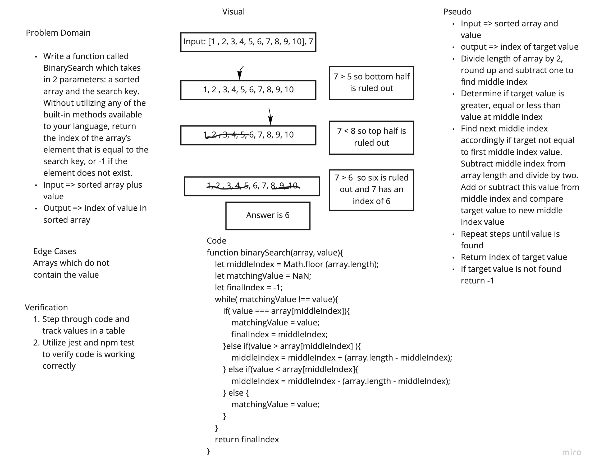

# Array Binary Search
Code Challenge 03

## Challenge
Create a function that will take in an array and a value as parameters and return the index of the value in the original array using a binary search approach.

## Approach & Efficiency
The approach I took was working through a whiteboard for this process. I utilized a while statement with inner if statements to examine whether or not the target value matched the array value at a middle index. If not I found the middle index of the half of the array in which the target value must reside repeating this process until the target is found. I included an else statement to account for the possibility of the target value not being included in the array.

## Solution

