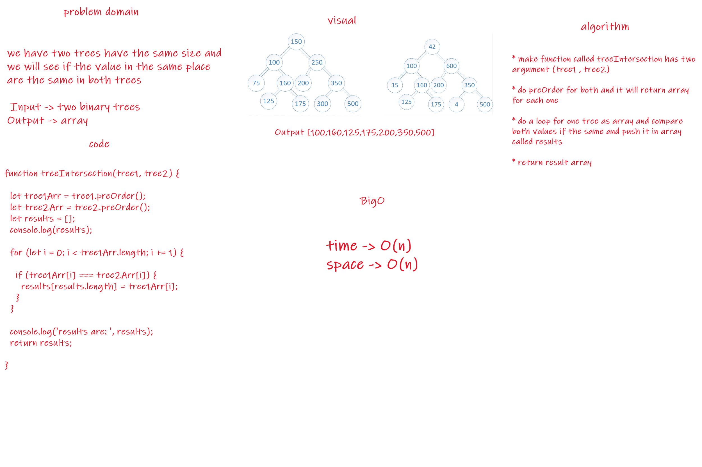

# Hashmap Tree Intersection

Find common values in 2 binary trees/Find all values found to be in 2 binary trees.

    Write a function called tree intersection
    Arguments: two binary trees
    Return: array

## Approach & Efficiency
<!-- What approach did you take? Why? What is the Big O space/time for this approach? -->
Space and time of O(n).

## Solution
<!-- Show how to run your code, and examples of it in action -->

## UML
