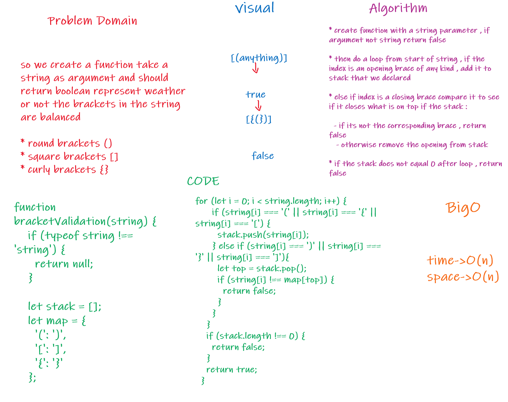

# Multi Bracket Validation
- Your function should take a string as its only argument, and should return a boolean representing whether or not the brackets in the string are balanced. There are 3 types of brackets:

  - Round Brackets : ()
  - Square Brackets : []
  - Curly Brackets : {}

## Challenge

- implement stack system

## Approach & Efficiency

- create function with a string parameter
- if parameter data type does not equal a string, return null
- create for loop to start at the beginning of string
- if the index of string is an opening brace of any kind, add it to the stack
- else if index of string is a closing brace of any kind, compare to see if it closes what is on top if the stack
- if it is not the corresponding brace, return false
otherwise remove the opening brace from stack and continue with the for loop
- if the stack does not equal 0 after the for loop, return false
- return true

## UML

  

