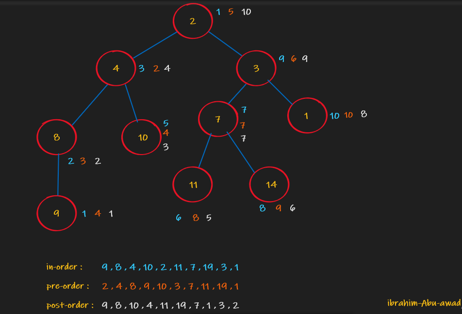

# Trees

Code Challenge 15

## Challenge

* Challenge 15: Create a Node class that has properties for the value stored in the node, the left child node, and the right child node , Create a Binary Tree class , Create a Binary Search Tree class

## Approach & Efficiency

Big O space is O(n) and time is O(1);

## API
 
- pre order
- post-order
- in-order
- add 
- contain

  
  ## whiteboard 

 

