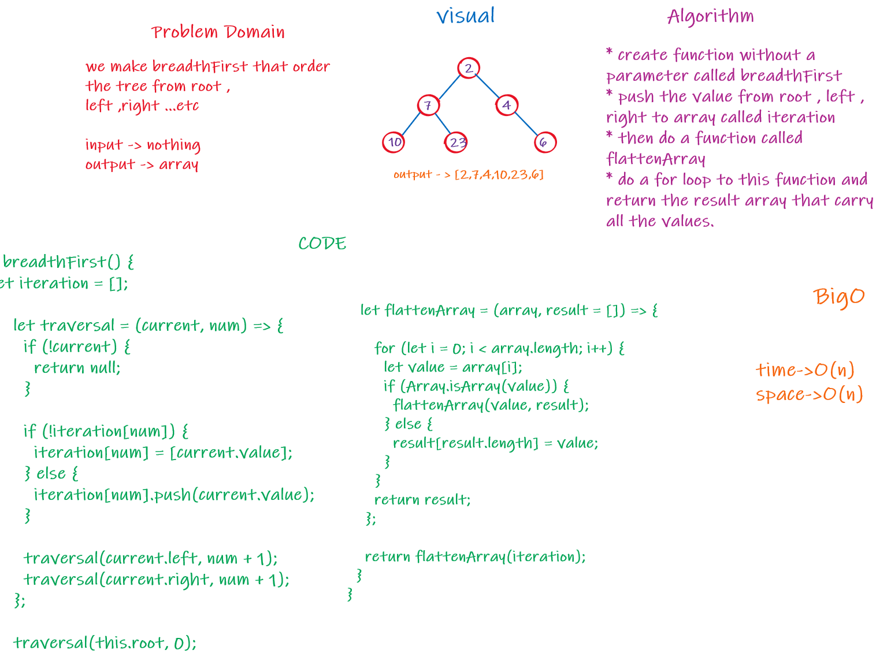
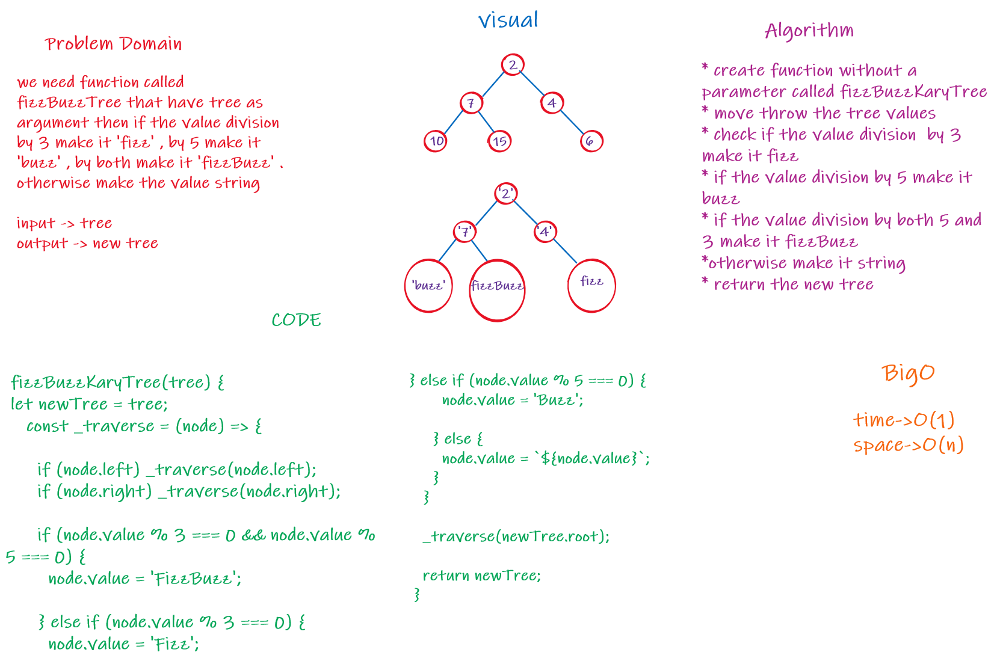

# Trees

Code Challenge 15 , 16 , 17 , 18

## Challenge

* Challenge 15: Create a Node class that has properties for the value stored in the node, the left child node, and the right child node , Create a Binary Tree class , Create a Binary Search Tree class

* Challenge 16: find the max value in the tree

* Challenge 17: Order the tree as root , left , right .. root , left , right ..etc

* Challenge 18: we need function called fizzBuzzTree that have tree as argument then if the value division by 3 make it 'fizz' , by 5 make it 'buzz' , by both make it 'fizzBuzz' . 
otherwise make the value string

## Approach & Efficiency

challenge 15 :

Big O space is O(n) and time is O(1);

challenge 16 : 

Big O space is O(n) and time is O(n);

challenge 17 : 

Big O space is O(n) and time is O(n);

challenge 18 : 

Big O space is O(n) and time is O(1);
## API

#### challenge 15 :

 - pre order
 - post-order
 - in-order
 - add 
 - contain

#### challenge 16 :

 - maxTree

#### challenge 17 :

 - BFS

 #### challenge 18 :

 - k_arr tree
  ## whiteboard 

### challenge 15 :

 

### challenge 16 :

 

### challenge 17 : 

### challenge 18 : 

