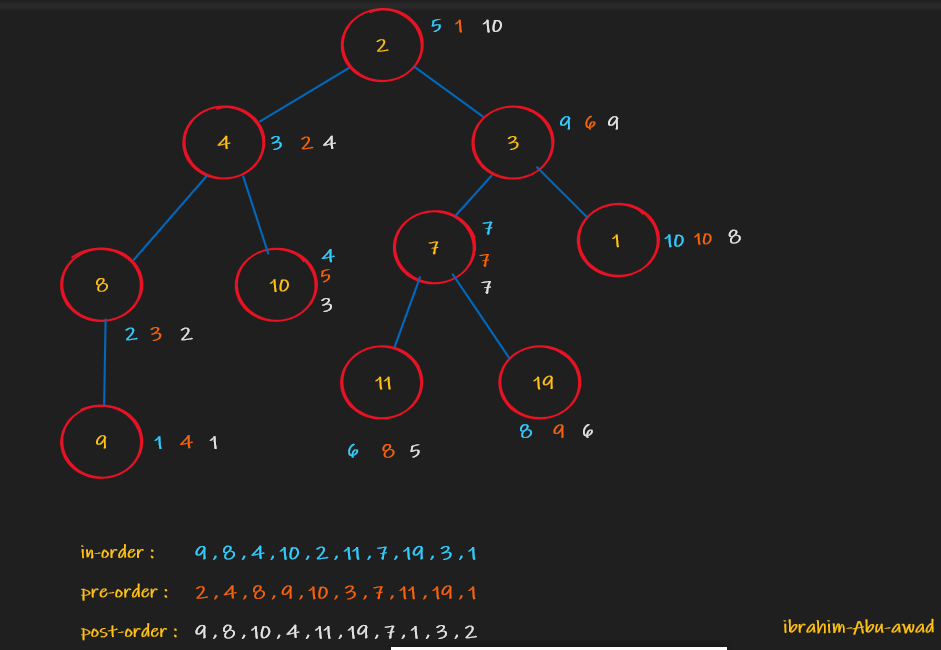
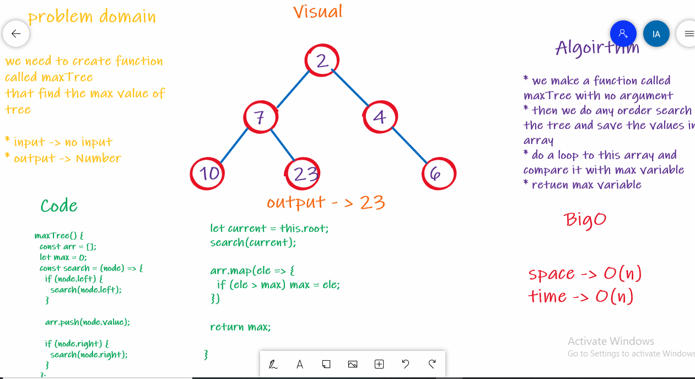

# Trees

Code Challenge 15 , 16

## Challenge

* Challenge 15: Create a Node class that has properties for the value stored in the node, the left child node, and the right child node , Create a Binary Tree class , Create a Binary Search Tree class

* Challenge 16: find the max value in the tree

## Approach & Efficiency

challenge 15 :

Big O space is O(n) and time is O(1);

challenge 16 : 

Big O space is O(n) and time is O(n);
## API

#### challenge 15 :

 - pre order
 - post-order
 - in-order
 - add 
 - contain

#### challenge 16 :

 - maxTree

  ## whiteboard 

### challenge 15 :

 

### challenge 16 :

 