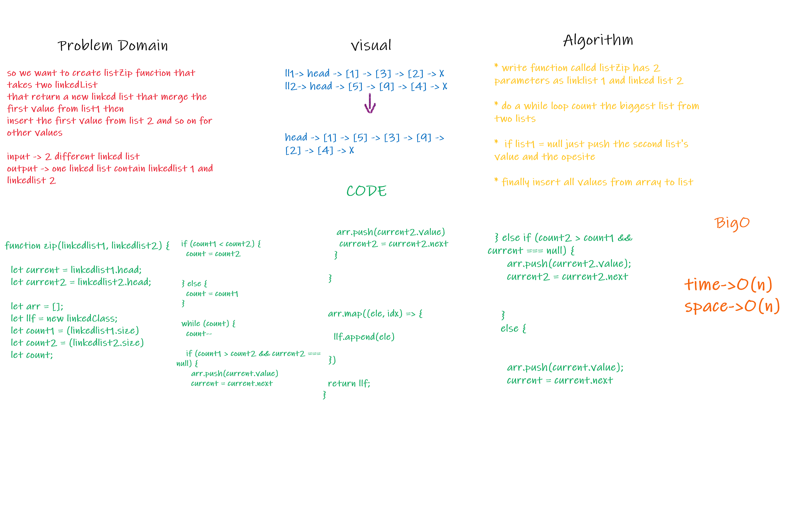

# zip List 
Code Challenge 08

## Challenge
Write a function called zip lists
Arguments: 2 linked lists
Return: Linked List, zipped as noted below

## Approach & Efficiency
The approach I took was working through a whiteboard for this process. I utilized a for loop after ascertaining the value of the middle index and pushed the value into the array when i was equal to the middle index.

## Solution
