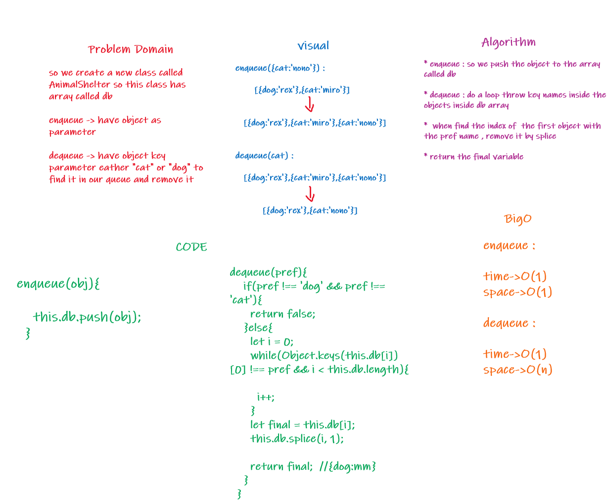

# queue shelter animal

Code Challenge 12

## Challenge

* Challenge 12: Using a FIFO database like an array as queue and insert in it dog or cat only

## Approach & Efficiency

Big O space is O(n) and time is O(1);

## API

- queue

 - .enqueue() : enqueue an object into queue eather cat or dog .

 - .dequeue() : remove first pref from queue eather cat or dog .
## UML 

  

